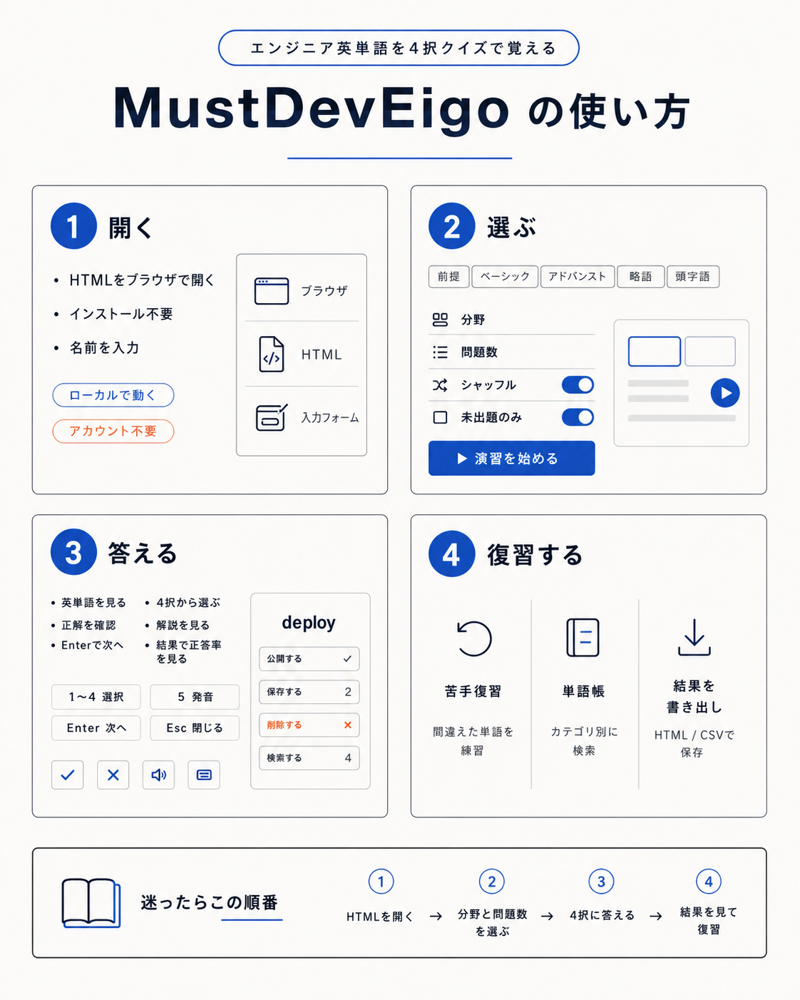

# MustDevEigo

MustDevEigo は、エンジニア必須英単語 615 語をブラウザで学べる、4 択クイズ形式の HTML 学習ツールです。

新卒・ジュニアエンジニアが、開発現場でよく出る英単語・略語・頭字語を短い演習で反復できるように作っています。インストールやアカウント登録は不要で、[MustDevEigo](https://rita-rita24.github.io/must-dev-eigo/) から使えます。

## 特徴

- **615 語収録**: 前提、ベーシック、アドバンスト、略語、頭字語を収録
- **4 択クイズ**: 英単語・略語・頭字語を見て、意味や元の英語表現を選択
- **ブラウザで動作**: インストール不要、アカウント不要で利用可能
- **演習設定**: 分野、問題数、シャッフル、未出題のみを選択可能
- **復習機能**: 間違えた単語を苦手として記録し、あとで復習
- **単語帳**: カテゴリ別に単語を確認・検索
- **結果保存**: セッション結果や学習履歴を HTML で保存

## 使い方

### 1. MustDevEigo を開く

[MustDevEigo](https://rita-rita24.github.io/must-dev-eigo/) をブラウザで開きます。

初回起動時に名前を入力します。名前は結果の HTML エクスポートに記載するためのもので、後から変更できます。

### 2. 分野と問題数を選ぶ

学習したい分野と問題数を選びます。

必要に応じて、次の設定も使えます。

- **シャッフル**: 出題順をランダムにする
- **未出題のみ**: まだ解いていない単語だけを出題する

設定ができたら **演習を始める** を押します。

### 3. 4 択に答える

表示された英単語・略語・頭字語に対して、4 つの選択肢から正しい答えを選びます。

解答後に正解・不正解が表示され、次の問題へ進めます。セッション終了後は正答率と解答結果を確認できます。

### 4. 結果を見て復習する

演習後は、間違えた単語を中心に復習できます。

- **苦手復習**: 間違えた単語だけを再演習
- **単語帳**: カテゴリ別に単語を確認・検索
- **結果を書き出し**: セッション結果や学習履歴を HTML で保存

## 収録カテゴリ

| 分野 | 語数 | 内容 |
| --- | ---: | --- |
| 前提 | 83 | 入門的な英単語 |
| ベーシック | 199 | 基本・頻出の英単語 |
| アドバンスト | 233 | やや高度な英単語 |
| 略語 | 70 | `attr`、`val`、`param` など |
| 頭字語 | 30 | `API`、`HTTP`、`JSON` など |
| **合計** | **615** |  |

## キーボード操作

| キー | 操作 |
| --- | --- |
| `1`〜`4` | 選択肢を選ぶ |
| `5` | 発音を聞く |
| `Enter` | 次の問題へ進む |
| `Esc` | ダイアログを閉じる |

## 迷ったらこの順番

1. [MustDevEigo](https://rita-rita24.github.io/must-dev-eigo/) をブラウザで開く
2. 分野と問題数を選ぶ
3. 4 択クイズに答える
4. 結果を見て、苦手な単語を復習する
